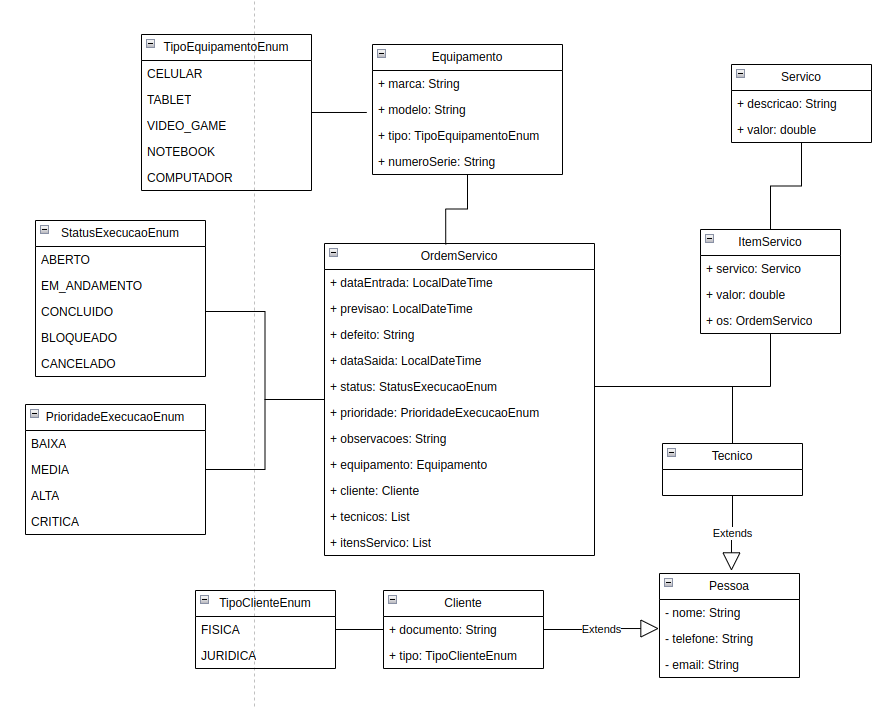

# PROPOSTA DO PROJETO - FIAP

Desenvolvimento de um sistema para administração de atendimentos técnicos de uma assistência técnica de 
equipamentos tecnológicos como, por exemplo, vídeo-games, computadores e dispositivos móveis.

